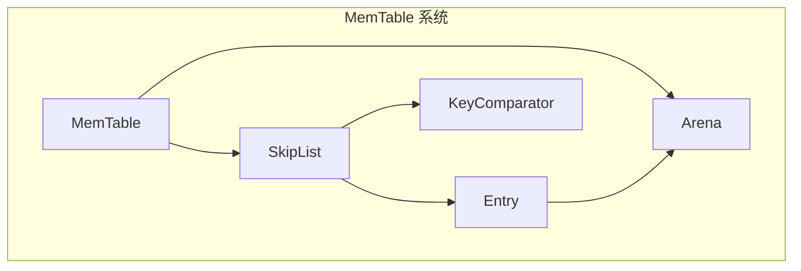
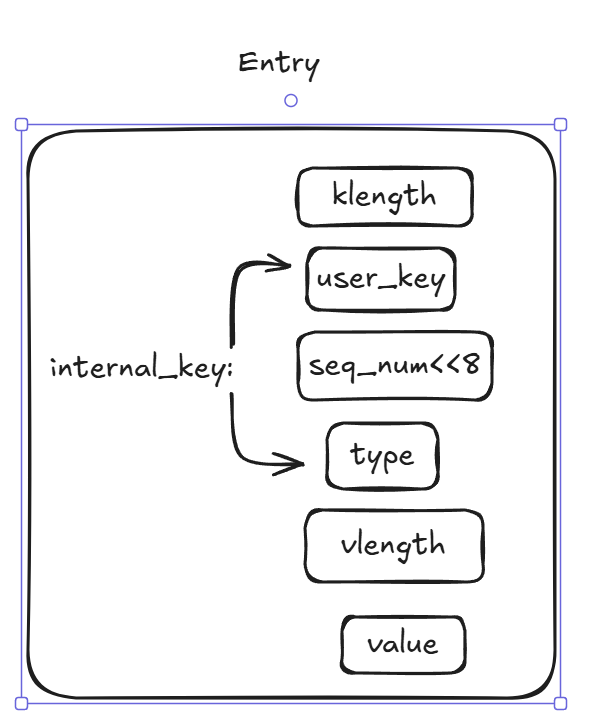

------

### 内存数据库

leveldb内存数据库基于跳表结构。

#### 跳表

```c++
template <typename Key, class Comparator>
class SkipList {
    private:
    struct Node;
}

template <typename Key, class Comparator>
struct SkipList<Key, Comparator>::Node {
    explicit Node(const Key& k) : key(k) {}
    
    const Key key;
    
    Node* Next(int n) {
        assert(n >= 0);
        return next_[n].load(std::memory_order_acquire);
    }
    
    void SetNext(int n, Node* x) {
        assert(n >= 0);
        next_[n].store(x, std::memory_order_release);
    }
    
    Node* NoBarrier_Next(int n) {
        assert(n >= 0);
        return next_[n].load(std::memory_order_relaxed);
    }
    
    void NoBarrier_SetNext(int n, Node* x) {
        assert(n >= 0);
        next_[n].store(x, std::memory_order_relaxed);
    }

private:
    std::atomic<Node*> next_[1];
};
```

#### memory_order 说明

- **memory_order_relaxed**: 只确保操作是原子性的，不对内存顺序做任何保证。
- **memory_order_release**: 用于写操作，例如 `std::atomic::store(T, memory_order_release)`，会在写操作之前插入一个 StoreStore屏障，确保屏障之前的所有操作不会重排到屏障之后。
- **memory_order_acquire**: 用于读操作，例如 `std::atomic::load(memory_order_acquire)`，会在读操作之后插入一个 LoadLoad 屏障，确保屏障之后的所有操作不会重排到屏障之前。
- **memory_order_acq_rel**: 等效于 `memory_order_acquire` 和 `memory_order_release` 的结合，同时插入一个 StoreStore 屏障与 LoadLoad 屏障，用于读写操作，例如 `std::atomic::fetch_add(T, memory_order_acq_rel)`。

#### 示例

```c++
// 线程 A (产生者)
node->data = 42;  // 初始化数据
list.SetNext(0, node);  // 通过 memory_order_release 让数据对其他线程可见

// 线程 B (消费者)
Node* node = list.Next(0);  // 使用 memory_order_acquire 获取节点
int value = node->data;  // 确保读取的是线程 A 完全初始化后的数据
```

编译器优化：编译器可能会认为，`node->data = 42` 和 `list.SetNext(0, node)` 没有直接依赖关系。因此，它可能将 `list.SetNext(0, node)` 提前。编译器这种优化是合法的，因为在单线程语境下，它认为不会改变行为。

#### 模板例子

```c++
template <typename T>
class Example {
public:
    struct NestedType {};     // 嵌套类型
    static int value;         // 静态非类型成员
};

template <typename T>
void Func() {
    Example<T>::NestedType* ptr;  // 嵌套类型
    Example<T>::value = 42;       // 静态成员
}

// 对于 Example<T>::NestedType，编译器可能无法区分它是一个类型还是非类型成员（如变量、函数等）。
// 在模板类或函数中，如果某个嵌套成员依赖于模板参数，编译器无法在模板实体化之前确定它的具体含义。

~~~c++
template <typename Key, class Comparator>
typename SkipList<Key, Comparator>::Node* SkipList<Key, Comparator>::NewNode(
    const Key& key, int height) {
  char* const node_memory = arena_->AllocateAligned(
      sizeof(Node) +
      sizeof(std::atomic<Node*>) * (height - 1));  // 动态内存分配Node*
  return new (node_memory) Node(key);
}
//t柔性数组和定制内存分配，优化了跳表的内存效率、访问速度
```

#### 跳表的查找

- 根据跳表高度选取最高层的头节点；
- 若小于，取该层的下一个节点；
- 若等于，则直接返回；
- 若大于且层高不为0，降低层高继续查找。

#### 跳表的插入

- 查找过程中，不断记录每层的前任节点；
- 为新节点随机生成层高，并根据前任节点信息，将节点插入到层的链表中；




